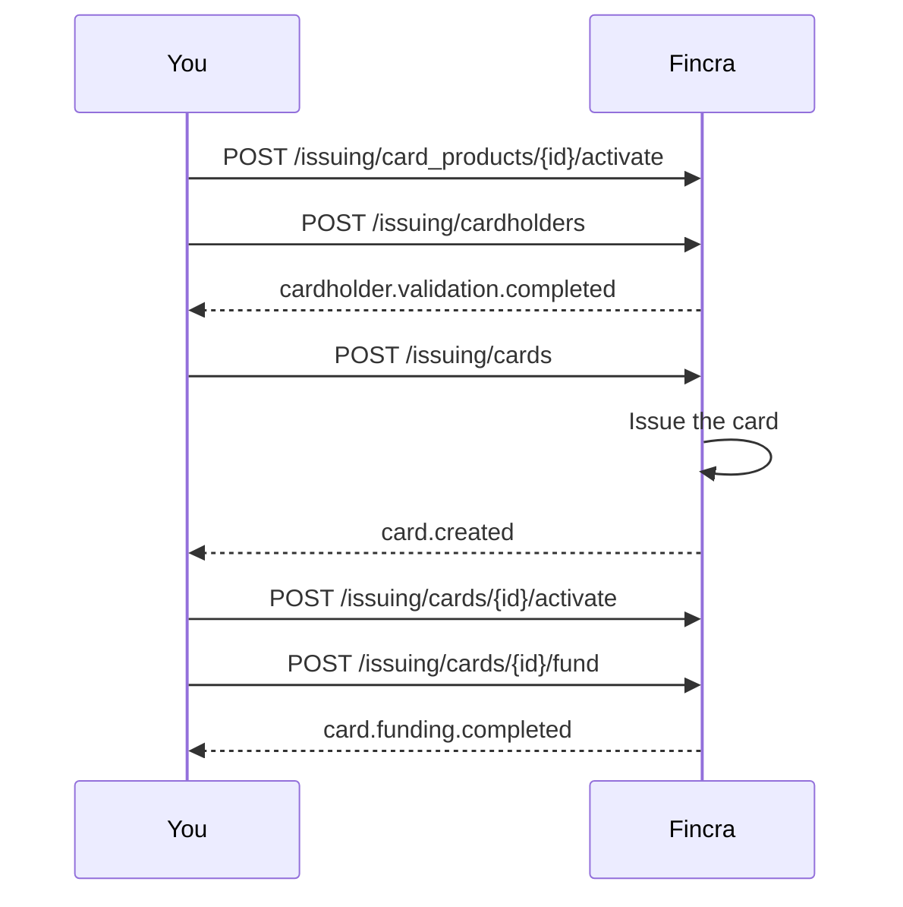

Issue virtual cards to your customers. Fincra issues the card, you fund it from your Fincra wallet, and the cardholder spends online.

Card issuing uses these objects. You make the setup objects once, then reuse them.

| Object           | What it is                                              | Ready when                                                                              |
| :--------------- | :------------------------------------------------------ | :-------------------------------------------------------------------------------------- |
| Card product     | The product a card is issued under. It sets the scheme. | `activationStatus` is `active`.                                                         |
| Business program | How a set of cards is funded and authorised. Optional.  | `status` is `active`.                                                                   |
| Cardholder       | The party the card is issued to.                        | `verificationStatus` is not `rejected`. Fincra sends `cardholder.validation.completed`. |
| Card             | One card issued to a cardholder.                        | `status` is `active`. Fincra sends `card.created`.                                      |
| Transaction      | One funding, spend or reversal on a card.               | Recorded as it happens.                                                                 |



## Three things to know

**A card spends from a balance you load.** A card is not an account. You fund the card from your Fincra wallet before the cardholder spends. Each card holds its balance apart from your wallet.

**Full card details are never returned in plain text on a normal call.** You reveal the card number, the security code and the expiry through a separate, single-use flow. See [Fund and reveal a card](doc:card-issuing-fund-and-reveal).

**A business outside Nigeria needs a Nigerian director.** To issue a card to a business registered outside Nigeria, at least one director must be Nigerian. Each cardholder needs a unique email, phone number and identity number.

## Card statuses

| Status      | What it means                                                       |
| :---------- | :------------------------------------------------------------------ |
| `pending`   | Fincra is still issuing the card.                                   |
| `inactive`  | Created, not yet activated. The card cannot transact.               |
| `active`    | Live. The card transacts once it is funded.                         |
| `cancelled` | Closed. A terminated card is cancelled and cannot return to active. |

A card also carries `isFrozen`. A frozen card is blocked for now, and you unfreeze it to restore it. Freezing is separate from the status.

## Before you begin

Put these five things in place first.

1. **An API key with the card issuing permission.** Get the key from your dashboard. See [Authentication](doc:authentication).
2. **Card issuing enabled for your business.** Ask your account manager.
3. **A funded wallet.** Fincra funds each card from your wallet.
4. **Your server IP addresses on the allow-list.** Production only. See [IP Whitelisting](doc:ip-whitelisting).
5. **A webhook URL.** Fincra sends `card.created`, `cardholder.validation.completed` and the funding status to it. See [Webhooks](doc:webhooks).

## Base URLs

Every card issuing call sits under the `/issuing` prefix.

| Calls                      | Sandbox                                 | Production                       |
| :------------------------- | :-------------------------------------- | :------------------------------- |
| All card issuing endpoints | `https://sandboxapi.fincra.com/issuing` | `https://api.fincra.com/issuing` |

Send your API key in the `api-key` header on every call.

```bash
curl https://api.fincra.com/issuing/card_products \
  -H "api-key: $FINCRA_API_KEY"
```

The one exception is the card-details reveal call, which uses a short-lived token instead of your API key. See [Fund and reveal a card](doc:card-issuing-fund-and-reveal).

## Test in the sandbox first

Run the whole flow in the sandbox with your test key before you go live: activate a card product, create a cardholder, create and activate a card, fund it, reveal the details, then read the balances and transactions.

| The sandbox does                                     | The sandbox does not                                      |
| :--------------------------------------------------- | :-------------------------------------------------------- |
| Validate every field and return every error.         | Issue a real card.                                        |
| Return every object, so you can walk the whole flow. | Move real money.                                          |
|                                                      | Check the IP allow-list or the Know Your Business status. |

When you go live, put your production IPs on the allow-list, get your Know Your Business status approved, set your live webhook URL, and switch the base URL to `https://api.fincra.com/issuing` with your live key.

## What is enabled for you

Fincra enables card issuing for each merchant one at a time, and sets the schemes, currencies and card types your business can issue. Ask your account manager what is enabled for you, and for your card limits and fees.

<Callout icon="📘" theme="info">
  ### Ask before you go live

  Tell your account manager before you issue your first card. Fincra turns the product on for each merchant one at a time.
</Callout>

## Abbreviations

| Abbreviation | Expansion                                                       |
| :----------- | :-------------------------------------------------------------- |
| BVN          | Bank Verification Number                                        |
| CVV          | Card Verification Value                                         |
| HMAC         | Hash-based Message Authentication Code                          |
| JIT          | Just-in-time, a real-time authorisation decision                |
| KYB          | Know Your Business                                              |
| KYC          | Know Your Customer                                              |
| MCC          | Merchant Category Code                                          |
| NIN          | National Identification Number                                  |
| PAN          | Primary Account Number, the full card number                    |
| RRN          | Retrieval Reference Number, a scheme reference on a transaction |

Next: [Cardholders](doc:card-issuing-cardholders).
