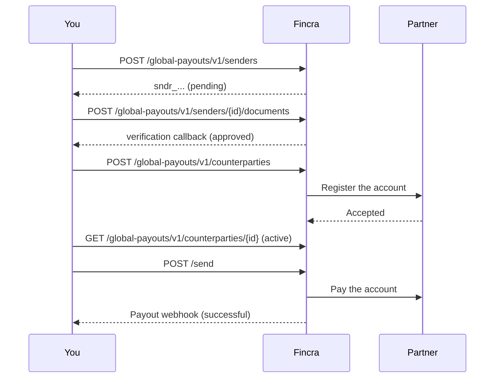

Send Chinese yuan to a bank account in mainland China. Fincra pays over CNAPS, the domestic clearing system of China.

A China payout uses three objects. You make the first two once, then reuse them.

| Object       | What it is                                                               | Ready when                                                         |
| :----------- | :----------------------------------------------------------------------- | :----------------------------------------------------------------- |
| Sender       | The party that sends the money.                                          | `verificationStatus` is `approved`. Fincra sends `sender.updated`. |
| Counterparty | The party that receives the money.                                       | `status` is `active`. Fincra sends `counterparty.updated`.         |
| Payout       | One payment from the sender to the counterparty, on the mode you choose. | `status` is `successful`                                           |

## Three things that make China different

**The payee name must match the bank record.** The payment partner checks the name of the counterparty against the name on the Chinese bank account. A name in Latin characters fails this check. Copy the name from the bank record of the payee.

**The account must be onshore.** CNAPS pays a bank account in mainland China. The address of the counterparty must be in China.

**Every payment needs a reason and evidence.** You send a purpose of fund. The purpose sets the trade details and the documents that Fincra needs before it pays.

## Two processing modes

You choose a processing mode for each payment. The mode sets when the payment settles, and it is one of the two things that set the fee.

| Mode    | When it settles                                      | What it suits                                                                         |
| :------ | :--------------------------------------------------- | :------------------------------------------------------------------------------------ |
| Normal  | Business hours, Monday to Friday. Settlement is T+1. | Planned payments. Supplier invoices and payroll runs with a known date.               |
| Instant | Any time, 24 hours a day, 7 days a week.             | Payments that cannot wait for the next business day, and weekend or holiday payments. |

Both modes pay a business bank account and an individual bank account. The mode does not limit the account type, and the account type does not limit the mode.

The fee depends on the mode and on the counterparty type. A business account carries a different fee from an individual account, so there are four fee cases. Fincra sets them per merchant.

## What Fincra does not pay

Fincra pays a Chinese bank account. Fincra does not pay an Alipay wallet, a WeChat Pay wallet or a UnionPay card.

## How long it takes

Make both parties days before your first payout. A new sender needs a verification that takes hours. A new counterparty needs a registration with the payment partner that takes up to 48 hours.

A payout that carries every document goes to the partner at once.

## Limits and cut-off times

Ask your account manager for the payment limit of your business, the cut-off time and the settlement time. Fincra sets these for each merchant.

<Callout icon="📘" theme="info">
  ### Ask before you go live

  Fincra enables each currency for each merchant one at a time. Tell your account manager before you send your first CNY payout.
</Callout>

## Abbreviations

| Abbreviation       | Expansion                                 |
| :----------------- | :---------------------------------------- |
| CNAPS              | China National Advanced Payment System    |
| CNY                | Chinese yuan                              |
| E.164              | The international telephone number format |
| ISO 3166-1 alpha-2 | The two-letter country code standard      |
| ISO 8601           | The date and time format standard         |

Next: [Before you begin](doc:china-payouts-before-you-begin).
