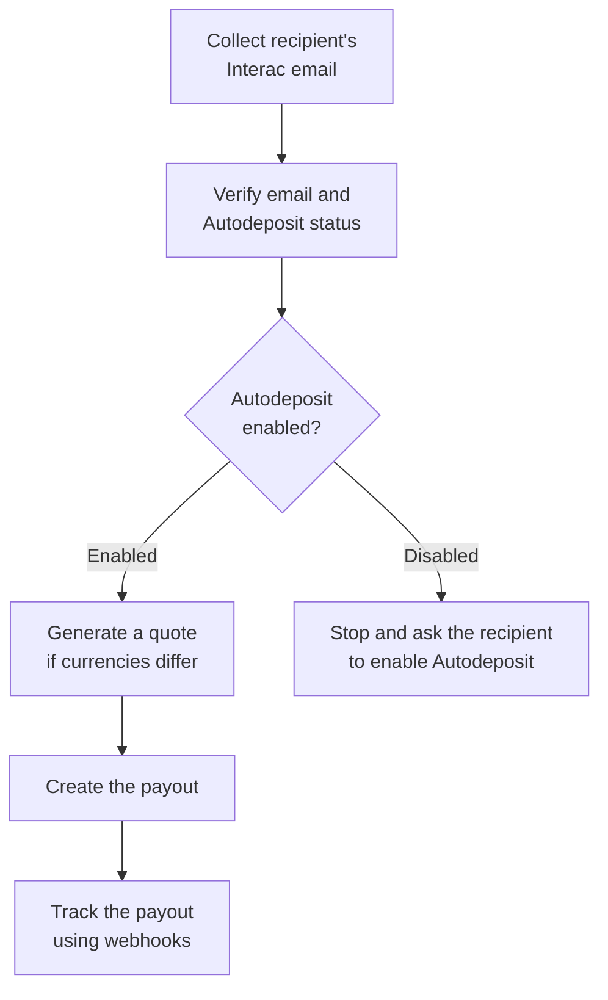

Use Fincra to send Canadian dollars directly to a recipient’s Canadian bank account through Interac e-Transfer.

The recipient is identified using the email address registered for Interac Autodeposit. You do not need their bank account number.

This guide explains how to:

- Verify that the recipient has Interac Autodeposit enabled.
- Send CAD from your CAD wallet.
- Send CAD from another supported currency, such as KES.
- Track the payout until it succeeds or fails.

