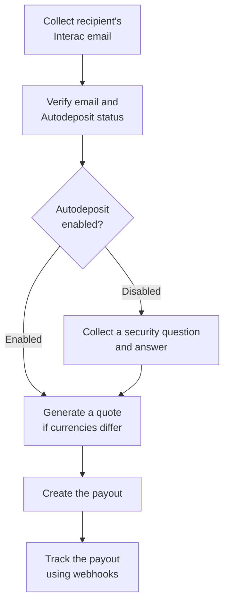

Use Fincra to send Canadian dollars directly to a recipient’s Canadian bank account through Interac e-Transfer.

The recipient is identified using the email address registered for Interac Autodeposit. You do not need their bank account number.

This guide explains how to:

- Verify that the recipient has Interac Autodeposit enabled.
- Send CAD from your CAD wallet.
- Send CAD from another supported currency, such as KES.
- Track the payout until it succeeds or fails.



The number of API calls depends on the source currency:

| Payout    | Required API calls                                    |
| --------- | ----------------------------------------------------- |
| CAD → CAD | Resolve recipient, then create payout                 |
| KES → CAD | Resolve recipient, generate quote, then create payout |

## Before you begin

You need:

- Your Fincra API credentials.
- Your Fincra business ID.
- Access to CAD payouts through Interac.
- A funded wallet for the source currency.
- The recipient’s Interac email address.
- The recipient’s legal account name.
- A webhook URL configured to receive payout updates.

<br />

## Step 1: Verify the recipient’s Interac email

Call the account-resolution endpoint before creating the payout.

This checks whether the email is registered for Interac Autodeposit and returns the name attached to the registered bank account.

`POST /accounts/resolve`

### Request

```json
 {
    "currency": "CAD",
    "type": "interac_etransfer",
    "interacEmail": "johnbarret@example.com"
  }
```

The currency must be CAD, and `interacEmail` must be a valid email address.

### Autodeposit enabled

A successful response with autoDepositEnabled: true means the recipient can receive the payout automatically.

```json
{
  "data": {
    "email": "johnbarret@example.com",
    "accountName": "John Barret",
    "autoDepositEnabled": true
  },
  "message": "Account resolve successful"
}
```

<br />

For example, if you send CAD 100 to `johnbarret@example.com`, the money will be deposited into the Canadian bank account linked to that email.

Before continuing, show the returned `accountName` to your user and ask them to confirm that it belongs to the intended recipient.

Use the returned name as `beneficiary.accountHolderName` when creating the payout.

### Autodeposit disabled

The resolution request may succeed while returning `autoDepositEnabled: false`.

```json
{
  "data": {
    "email": "johnbarret@example.com",
    "accountName": null,
    "autoDepositEnabled": false
  },
  "message": "Account resolve successful"
}
```

This is not an API error. You can still create the payout by including `beneficiary.securityQuestion` and `beneficiary.securityAnswer`. The recipient will use the answer to claim the Interac transfer.

## Step 2: Generate a quote for a cross-currency payout

Skip this step when both the source and destination currencies are CAD.

When the source currency differs from CAD, generate a quote before creating the payout. The quote calculates the conversion rate, applicable fee, source amount and CAD amount the
recipient will receive.

For example, generate a quote when funding the CAD payout from a KES wallet.

`POST /quotes/generate`&#x20;

### Request

```json
{
  "business": "{{businessID}}",
  "sourceCurrency": "KES",
  "destinationCurrency": "CAD",
  "amount": 10000,
  "action": "send",
  "transactionType": "disbursement",
  "paymentDestination": "bank_account",
  "paymentScheme": "interac",
  "beneficiaryType": "individual"
}
```

Because the action is send, the amount represents the amount being sent from the source wallet. In this example, the merchant wants to fund the payout with KES 10,000.

### Response

The exact converted amounts and rate will depend on the quote generated at request time.

```json
{
  "data": {
    "sourceCurrency": "KES",
    "destinationCurrency": "CAD",
    "sourceAmount": 10000,
    "destinationAmount": 100,
    "amountToCharge": 10000,
    "amountToReceive": 100,
    "rate": 0.01,
    "fee": 0,
    "reference": "b862026b-c15c-46b1-b1d4-f584f80b53ea",
    "expireAt": "2026-09-13T21:30:00.000Z"
  },
  "message": "Quote generated successfully"
}
```

**The amounts above are illustrative.**

Store `data.reference`. You will pass it as `quoteReference` when creating the payout.

The following values must agree with the generated quote:

- sourceCurrency
- destinationCurrency
- amount
- quoteReference

The payout amount must equal the quote’s sourceAmount. You must generate another quote if the existing quote expires or the payout amount changes.

## Step 3: Create the payout

After checking the Autodeposit status, create the payout. If Autodeposit is disabled, include a security question and answer.

`POST /disbursements/payouts`

Use:

- CAD as the destination currency.
- `bank_account` as the payment destination.
- `interac` as the payment scheme.
- `CA` as the beneficiary country.
- The verified email as `beneficiary.interacEmail`.
- The resolved recipient name as `beneficiary.accountHolderName`.

The amount must be a JSON number, not a string.

### Send CAD from a CAD wallet

A same-currency payout does not require a quote.

```json
{
  "business": "{{businessID}}",
  "sourceCurrency": "CAD",
  "destinationCurrency": "CAD",
  "amount": 100,
  "description": "CAD payout via Interac",
  "paymentDestination": "bank_account",
  "paymentScheme": "interac",
  "customerReference": "cad-interac-001",
  "beneficiary": {
    "firstName": "John",
    "accountHolderName": "John Barret",
    "interacEmail": "johnbarret@example.com",
    "type": "individual",
    "country": "CA"
  }
}
```

In this example, CAD 100 is funded from the merchant’s CAD wallet and sent to the bank account registered to `johnbarret@example.com`.

### Send CAD from a KES wallet

A cross-currency payout must include the reference returned by the quote endpoint.

```json
{
 "business": "{{businessID}}",
  "sourceCurrency": "KES",
  "destinationCurrency": "CAD",
  "amount": 10000,
  "quoteReference": "b862026b-c15c-46b1-b1d4-f584f80b53ea",
  "description": "KES to CAD payout via Interac",
  "paymentDestination": "bank_account",
  "paymentScheme": "interac",
  "customerReference": "kes-cad-interac-001",
  "beneficiary": {
    "firstName": "John",
    "accountHolderName": "John Barret",
    "interacEmail": "johnbarret@example.com",
    "type": "individual",
    "country": "CA"
  }
}
```

Here, amount is KES 10,000 because KES is the source currency. It must match the quote’s `sourceAmount`.

### Send when Autodeposit is disabled

If autoDepositEnabled is false, include a security question and answer in the payout request. The recipient will use the answer to claim the Interac transfer.

```json
{
  "business": "{{businessID}}",
  "sourceCurrency": "CAD",
  "destinationCurrency": "CAD",
  "amount": 100,
  "description": "CAD payout via Interac",
  "paymentDestination": "bank_account",
  "paymentScheme": "interac",
  "customerReference": "cad-interac-002",
  "beneficiary": {
    "firstName": "John",
    "accountHolderName": "John Barret",
    "interacEmail": "johnbarret@example.com",
    "securityQuestion": "What city did we meet in?",
    "securityAnswer": "Calgary",
    "type": "individual",
    "country": "CA"
  }
}
```

The security question must not exceed 40 characters. The answer must contain 3 to 25 characters and must not contain spaces. Send both fields together.

### Important fields

| Field                           | Description                                                                            |
| ------------------------------- | -------------------------------------------------------------------------------------- |
| `business`                      | Your 24-character Fincra business ID.                                                  |
| `sourceCurrency`                | Currency of the wallet funding the payout.                                             |
| `destinationCurrency`           | Must be `CAD`.                                                                         |
| `amount`                        | Amount in the source currency, supplied as a JSON number.                              |
| `quoteReference`                | Required when the source currency is not `CAD`.                                        |
| `description`                   | A non-empty description of the payout.                                                 |
| `customerReference`             | Your unique reference for identifying and reconciling the payout.                      |
| `paymentDestination`            | Must be `bank_account`.                                                                |
| `paymentScheme`                 | Must be `interac`.                                                                     |
| `beneficiary.country`           | Must be `CA`.                                                                          |
| `beneficiary.interacEmail`      | Recipient’s verified Interac email.                                                    |
| `beneficiary.accountHolderName` | Name returned or confirmed during account resolution.                                  |
| `beneficiary.securityQuestion`  | Required when Autodeposit is disabled. Maximum 40 characters.                          |
| `beneficiary.securityAnswer`    | Required when Autodeposit is disabled. Must contain 3 to 25 characters with no spaces. |

<br />

## Step 4: Handle the payout response

A successful request means Fincra has accepted the payout for processing. It does not necessarily mean the recipient has already received the money.

A response can look like this:

```json
{
  "data": {
    "id": 12345,
    "reference": "FPY-8E74262E",
    "customerReference": "cad-interac-001",
    "status": "processing",
    "message": null,
    "isDocumentRequired": false,
    "documentsRequired": []
  },
  "message": "Payout initiated successfully."
}
```

Store both references:

- reference is the Fincra-generated payout reference.
- customerReference is the reference supplied by your application.

Use these references when reconciling the payout, investigating an issue or matching webhook events to your internal transaction.

## Step 5: Track the final payout status

Payout processing is asynchronous. Use payout webhooks to determine whether the transfer eventually succeeds or fails.

A successful payout produces:

`payout.successful`

A failed payout produces:

`payout.failed`

A webhook contains the Fincra reference, your customer reference, the recipient, currencies, amounts, payment scheme and final status.

Example successful webhook excerpt:

```json
{
  "event": "payout.successful",
  "data": {
    "id": 12345,
    "reference": "FPY-8E74262E",
    "customerReference": "cad-interac-001",
    "sourceCurrency": "CAD",
    "destinationCurrency": "CAD",
    "status": "successful",
    "amountCharged": 100,
    "amountReceived": 100,
    "paymentScheme": "interac",
    "paymentDestination": "bank_account",
    "recipient": {
      "name": "John Barret",
      "type": "individual",
      "interacEmail": "johnbarret@example.com"
    }
  }
}
```

## Common integration errors

### Autodeposit is disabled

The resolution request succeeds, but `autoDepositEnabled` is `false`. This is not an API error. Include `beneficiary.securityQuestion` and `beneficiary.securityAnswer` when creating
the payout.

Because `accountName` is `null`, collect the recipient’s legal account name and send it as `beneficiary.accountHolderName`.

### The security question or answer is missing

Both fields are required when Autodeposit is disabled. Do not send only one of them.

### The security question or answer is invalid

The security question must not exceed 40 characters. The answer must contain 3 to 25 characters and must not contain spaces.

Use only standard letters, numbers and punctuation. Do not use accented letters, emoji or line breaks.

### The payout needs to be submitted again

Fincra does not store the security question and answer. Create a new payout request and include both fields again.

### The quote reference is missing

This happens when you create a cross-currency payout without first generating a quote. Generate a new quote and include its reference as `quoteReference`.

### The quote amount does not match the payout amount

The payout amount must equal the quote’s `sourceAmount`. Generate a new quote if the source amount changes.

### The quote has expired

Generate another quote and use its new reference.

### The beneficiary country is missing or incorrect

Use:

```json
 "country": "CA"
```

### The Interac email is missing or invalid

Provide the same valid email address used for the account-resolution check.
